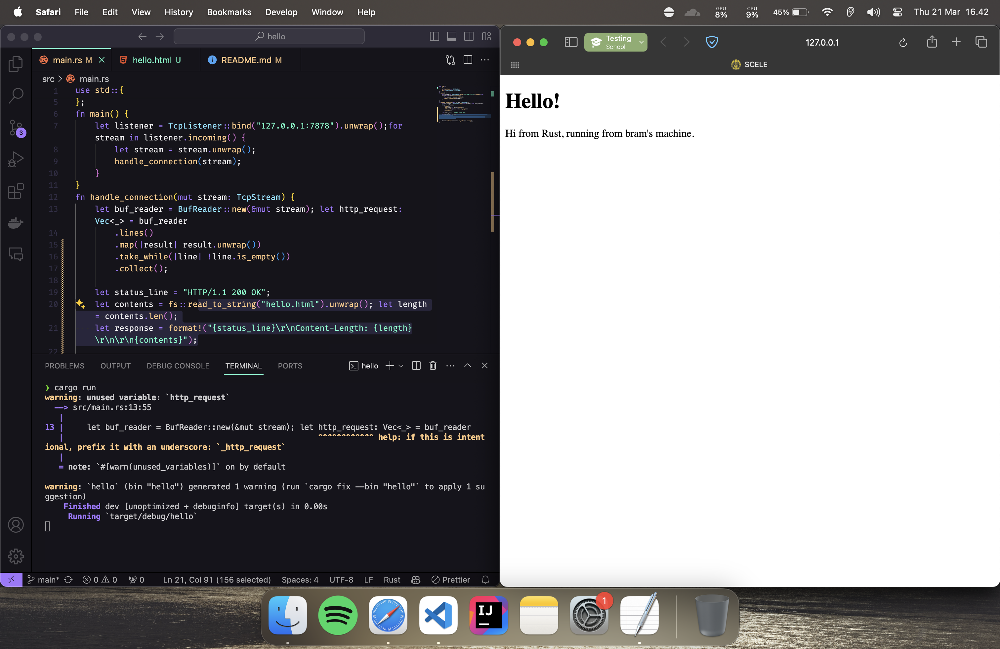
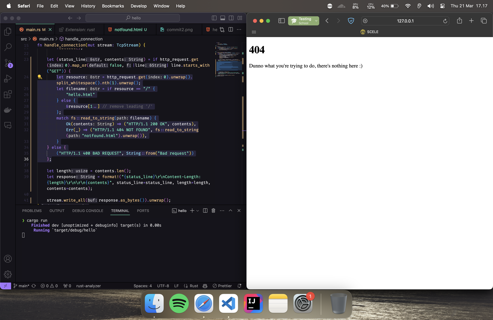

# **Advanced Programming - Module 6: Concurrency**

## Bramantyo Priyo Utomo - 2206821563

### 1. `handle_connection` method elaboration

- The handle_connection method in the main Rust code is responsible for handling incoming TCP connections from clients. It reads the HTTP request from the client and prints it to the console.
- `let buf_reader = BufReader::new(&mut stream);` This line creates a buffered reader from the mutable TCP stream. The buffered reader allows efficient reading of data from the stream.
- `let http_request: Vec<_> = buf_reader.lines().map(|result| result.unwrap()).take_while(|line| !line.is_empty()).collect();` This line reads the HTTP request from the client. The `lines()` method reads the request line by line. The `map()` method transforms each line into a `Result<String, io::Error>`. The `unwrap()` method is used to unwrap the Result and get the String value. The `take_while()` method takes lines from the iterator until a line that is empty is encountered. The `collect()` method collects the lines into a `Vec<String>`.
- `println!("Request: {:#?}", http_request);` This line prints the HTTP request to the console. The {:#?} syntax is used to pretty-print the request.

### 2. new `handle_connection` method to parse a 200 OK response

- The function then constructs an HTTP response. The status line of the response is set to "HTTP/1.1 200 OK", indicating a successful HTTP request. The contents of the response are read from a file named "hello.html". The length of the contents is calculated and set as the "Content-Length" header of the response.
- The `handle_connection` function is called for each incoming connection in the `main` method. The `main` method listens for incoming TCP connections on the IP address "127.0.0.1" and port "7878". For each incoming connection, the `handle_connection` function is called to handle the connection.

### 3. new `handle_connection` method to parse a 404 Not Found response

- The function then constructs an HTTP response. The status line of the response is set to "HTTP/1.1 404 NOT FOUND", indicating an unsuccessful HTTP request. The contents of the response are read from a file named "404.html". The length of the contents is calculated and set as the "Content-Length" header of the response.
